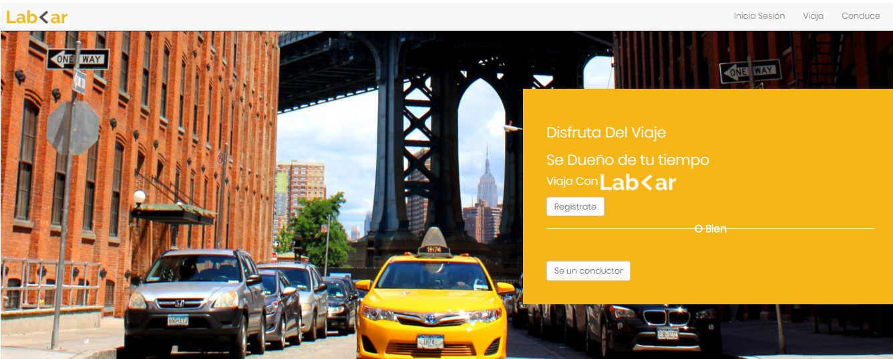
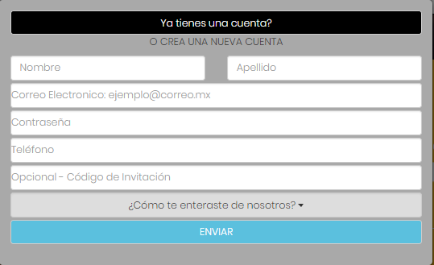
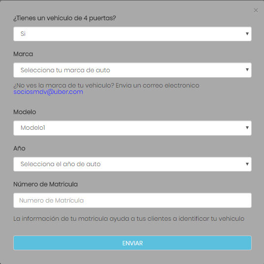

# Lab<ar
  
  

Lab<ar es una aplicación web responsiva en donde los usuarios pueden pedir servicio de taxi para sus travesias necesarias o unirse a la empresa a encontrar una oportunidad laboral. Cualquiera de estas opciones que desees usar, te damos la grata bienvenida a LAB<AR!

## Reto
  
  El reto a sido creado por la empresa __Laboratoria__ en donde tuvimos que poner en practica los conocimientos sobre el framework: _bootstrap_, para el fin de realizar una página web responsiva de una manera rapida y eficaz.

## Herramientas usadas

- Bootstrap3
- Media Queries
. HTML5
- CCS3

## Secciones

  1. En la parte de header hemos creado un Nav-bar, con la ayuda de bootstrap, para la versión web. Las opciones a escoger han sido 'Inicio de sesión', 'Viajes' para ver los trayectos y 'Conduce' para los trabajadores de nuestEra app. En la versión mobile, hemos incluido esta sección en un menú hamburguesa.

  2. En esta sección queremos captar el ojo del usuario con una imagen relevante a nuestro negocio y la opción de registro para el usuario que desea usar nuestra aplicación o un conductor que desee trabajar con nosotros

  3. En la tercera sección hacemos un introducción breve sobre como funciona nuestra aplicación y .

  4. En la cuarta sección, recalcamos la opción para que conductores experimentados empiecen a trabajar de la mano con nosotros para que puedan alcanzar sus metas financieras y sean dueños de su tiempo.

  5. En la quinta sección, puedes trazar la ruta de ida y de vuelta donde podras ver el tiempo que durara el viaje y cifra estimada de ello.

  6. Por ultimo, tenemos el footer donde los usuarios podran ver la información de la empresa y sus dudas por resolver.

## Modales:  

- __Registro de Información de Usuario:__  

- __Registro de usuarios:__

- __Registro de conductores:__

## Extra: Versión mobile

